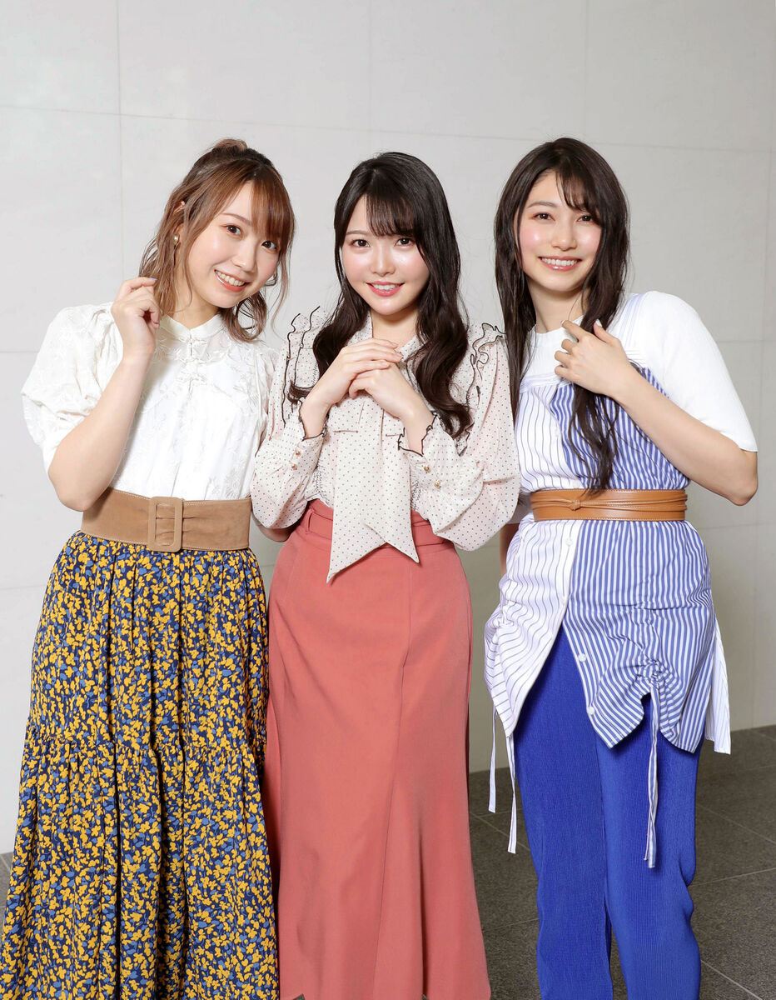
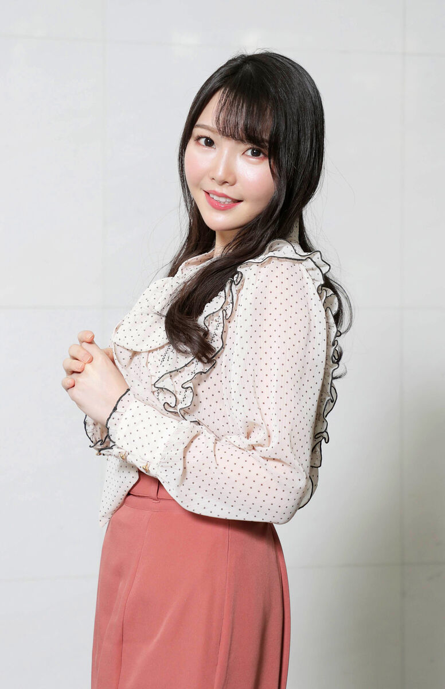
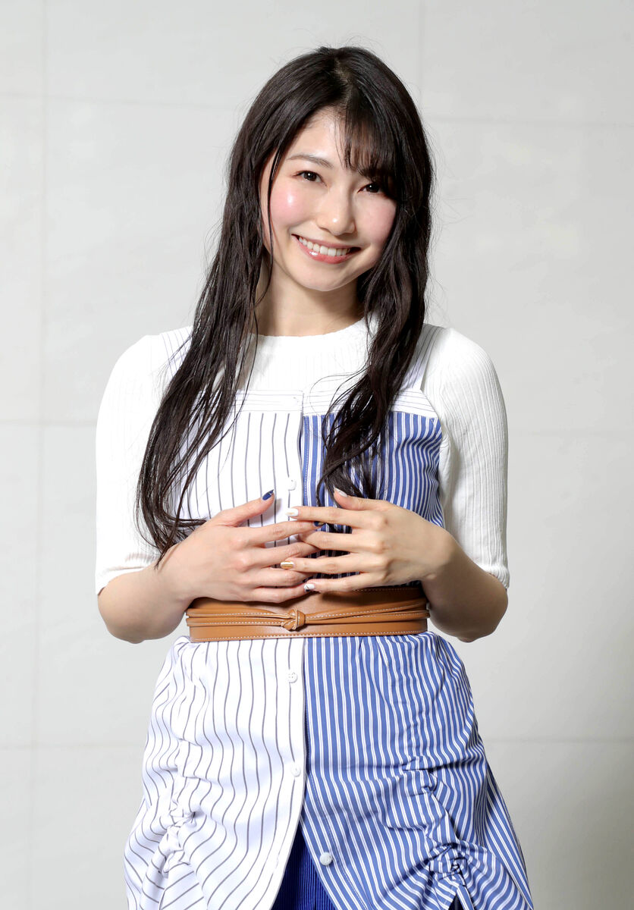

ＴｒｙＳａｉｌ（トライセイル）麻倉もも、雨宮天、夏川椎菜「難しいながらも楽しんで歌うことができた」…インタビュー完全版
===

* 2022年3月18日 2時0分スポーツ報知
* 構成・国分　敦
* カメラ・関口　俊明

　３人組の人気声優ユニットのＴｒｙＳａｉｌ（トライセイル）のメンバー、麻倉もも（２７）、雨宮天（２８）、夏川椎菜（２５）の３人による企画アルバム「シャッフル―Ｂｒｉｇｈｔ　３　Ｗａｖｅｓ―」が１６日に発売された。同盤は互いのソロ曲をカバーしたもので、３人は「新たな発見があった」と笑顔を見せた。また、ユニットとして４月６日に発売される新曲「Ｌａｐｉｓ」には「レコーディングには気を使った」とも。アルバムのメンバーの“推し曲”を始め、ソロとユニット活動での違いやライブへの思いなど聞いた。

   

# [Part 1](https://hochi.news/articles/20220315-OHT1T51105.html?page=1)

　同作は３人のメンバーが互いのソロ曲をカバーしたり、デュエットすることでオリジナル曲とは違った魅力を引き出している。３人は初めての試みを好意的に受け取っていたようだ。

　夏川「お話を聞いた時に、また新しいことに挑戦できるなって思いました。長くやってきたからこそできることだし、トライセイルだけではできなくて、３人がソロ活動をしてきたからこそできた企画だったと思います。完成してみてうれしかったです」

　麻倉「最初に聞いた時、単純に面白い企画だなと思いました。まだ何を歌うのか決まってなかったので、２人には（私の）意外な曲を歌ってほしいとか、私も（２人の意外な曲を）歌いたいっていう気持ちはありました。結果的に３人で話し合って、誰の歌を誰々に歌ってもらうみたいな話はしました」

　雨宮「私、『お酒を飲んだ時に２人のソロ曲を歌っている』ってお客さんに話していたので『カバーしてほしい』みたいな話も頂いていました。お客さん的には楽しい企画かな～と思いつつ、歌の得意分野や声のレンジ（音域）も全然違うから、最初はカバーできるか不安はありました」

　他のメンバーの曲を歌うことで新たな気づきもあったという。

　夏川「私は天（てん）さんの曲をデュエット含めて２曲を歌わせていただきましたが、私とかなりレンジが違って、いつもは歌わない音なので苦戦しました。表現の方法でも自分のソロではやらない手法や表情感の違いもあり、そこの調整も大変でしたね。元々知ってる曲でしたが『２人の癖をちょっとリスペクトしてやろう』という気持ちで聴き込んだんですが『私にはできないことをやってるな～』っていうのを逆に感じました」

　―２人の特徴はどんなところなのか。

　夏川「麻倉だったら、やっぱ高いところに行ったとき。声が“キュルン”ってなるっていうか、一瞬、シャクル感じがすごい。でも、なかなか再現できなくて、ちょっと難しいと思ってやっていました。天さんは曲の世界観がしっかりあって、物語を紡ぐストーリーテラーみたいな感じで歌っている。細かいビブラートもすごいし、再現したいと思いつつもちょっと難しかったですね」

　麻倉「２人が歌っている楽曲って、私がソロとしては歌ったことのないような作品だったので『結構難しいな～』って思っていました。でも、この企画自体がちょっとお祭り的な要素もあったので、難しいながらも楽しんで歌うことができたかな～。歌ってみて改めて２人のすごさっていうのも感じました。（アルバムには）デュエット曲があるんですが、３人で声を合わせることはあっても、２人で合わせることがなかったので『１人欠けただけで、全然違ったふうに聞こえるんだ』って実感しました。ソロや３人で歌っている時と違った曲になっていると思います」

　雨宮「３人で（何を歌うかを）話し合って、歌った本人が選曲してくれた曲だったから楽しく歌えました。私はキャラソン（特定のキャラクターになり切って歌う曲）のような気持ちで、曲を聴いて思い浮かんだキャラクター像を作り上げて、それに乗せつつ夏川が言ってたようにご本人リスペクト、本人のエッセンスも入れる感じで歌いました」

　　◆収録全９曲◆

　▼麻倉もも「Ｓｋｙｒｅａｃｈ」（オリジナル・雨宮天）

　▼雨宮天「パンプキン・ミート・パイ」（オリジナル・麻倉もも）

　▼麻倉もも・雨宮天「イエローフラッグ」（オリジナル・夏川椎菜）

　▼夏川椎菜「Ｆａｎｆａｒｅ！！」（オリジナル・麻倉もも）

　▼麻倉もも「フワリ、コロリ、カラン、コロン」（オリジナル・夏川椎菜）

　▼麻倉もも・夏川椎菜「ＶＩＰＥＲ」（オリジナル・雨宮天）

　▼夏川椎菜「Ｓｉｌｅｎｔ　Ｓｗｏｒｄ」（オリジナル・雨宮天）

　▼雨宮天「ラブリルブラ」（オリジナル・夏川椎菜）

　▼雨宮天・夏川椎菜「ユメシンデレラ」（オリジナル・麻倉もも）

　―今回のアルバムで“推し曲”は何になる？

　夏川「２人がデュエットしてくれた私の『イエローフラッグ』。この曲はラップじゃないけどちょっと早口の部分があるリズム重視の楽曲なんです。２人のソロにもない曲調なので、どういうふうに歌ってくれるのかって楽しみにしていたんですが、２人が歌うとこうなるんだなって。自分とは違ってかわいく歌うとこうなるとか、低めに歌ったらこうなるんだなとか…。これはお客さんも驚く一曲だと思いますよ」

　麻倉「天さんの『ＶＩＰＥＲ』っていう楽曲を、麻倉と夏川で歌ったんですが、私が歌った中で一番苦戦した曲です。天さんの世界観が濃く出ている作品で、カッコ良さと色気みたいなのが入っていて『それをこの２人でどう出すんだ』って思いながら、２人がかりで結構いろんなことをしましたが、そこに到達したのか、してないのかみたいな…」

　―レコーディングも苦労したのか。

　麻倉「はい、結構テイクは重ねました。息の抜き方とかもニュアンスをつけるのが難しい楽曲で、歌といえどもセリフっぽいところもあったりで、とにかくニュアンスの付け方がすごく難しい曲なんです。結果的にオリジナルとは全く違う曲になったなあ～っていう印象がありますが、自分が『頑張った』っていう意味も含めての私の推し曲です。私たち２人の頑張りを聴いてほしいです（笑い）」

　雨宮「私は２人の『ＶＩＰＥＲ』もお薦めなんですけど、私が歌って楽しかったのが夏川の『ラブリルブラ』。ご本家の夏川が滑舌をだいぶ甘めに歌っていて『確かにちょっとゆるく歌っても、すごく似合う楽曲だな』って。それを踏まえた上、ご本家へのリスペクトにプラス私の中のキャラクター的解釈を乗せて歌いました。演技のしがいがあって、自由度高く歌ったので聴いてほしいです」

# [Part 2](https://hochi.news/articles/20220315-OHT1T51106.html?page=1)

　３人の企画アルバムに続き、４月にはＴｒｙＳａｉｌとして１３枚目のシングル「Ｌａｐｉｓ」が４月に発売される。同作はアニメ「マギアレコード　魔法少女まどか☆マギカ外伝　２ｎｄ　ＳＥＡＳＯＮ―覚醒前夜―」のエンディング曲で、独自の世界観を持っている作品のため収録では苦労もあったようだ。

　夏川「とにかく曲に何か脱力感があって、サビとかは結構、情熱的なところと感傷的なところが多いんです。心の深い底のほうまで沈んでいく感じを出すために、とにかく声の力をなくすというか、フワっと歌うけどメッセージを伝えるっていうような…。そこのバランスが難しくて、結構調整した覚えがあります」

　麻倉「『世界に一人ぼっち』みたいな世界観の曲なんです。どんどん沈んでいく感じだったので、レコーディングの時はカーテンを全部閉めて、ブースの中をちょっと薄暗くしてもらいました。一人っきりの世界に近い環境にしてもらったおかげで、余計なことを考えず孤独から出る気持ちを乗せて取りました」

　雨宮「夏川が言っていたように、結構サビがガツンとアタック強めに来るんです。けど歌詞で言うところの一番最後の行では突然フッと力が抜け、ＡメロＢメロでの絶望感を突然取り戻すみたいな感じあるので、そこの抑揚は大げさに付けたかな。聴いている人をこうドキッとさせたり、ちょっと不安にさせる意識もありましたし…。特に落ちサビのところはささやくように歌っているんですけど『もっと聞こえないくらい小さい声で』って言われて、この声量で歌ったことないっていうぐらい、小さな声で歌ったのが印象的です」

　ＴｒｙＳａｉｌは２０１５年５月に「Ｙｏｕｔｈｆｕｌ　Ｄｒｅａｍｅｒ」でデビューした。これまで多くの楽曲を発表しているが、３人の歌のパート分けはどういった形で決まるのか。

　夏川「基本的には３人全員がそれぞれ（１曲を）レコーディングしてから、ディレクターさんが３人のいいところやバランス、曲のイメージで選んでくれます。それを私たちも確認していく感じです。曲によっては、聴いていて気持ちのいい歌割りと歌って気持ちいい歌割りがちょっと違うみたいで『ここで切れちゃうと、気持ち的につながりが気持ち悪いよね』ってなっちゃったり、逆に『ここまで１人のパートが長いと息が難しい。切ったほうが自然だよね』とかありますね。ライブで歌うことも多いので、歌う側の意見はしっかり伝えています」

　ユニットでは基本的には３人でのハーモニーはあまりないが、ストレスを感じることはないのだろうか。

　雨宮「私たちのライブって歌を聴かせるというよりは、お客さんを巻き込んで一緒に楽しむみたいな感じなんですね。聴かせるバラードでユニゾンが多いとなると、３人のしたい表現が違った時にはすり合わせでちょっとストレスが生まれるのかもしれないんですね。でも、基本的にはみんなで一緒になって楽しもうみたいな曲が多いから、ストレスを感じたことはないです」

　昨年、コロナ禍で休止していたライブ活動が再開された。ファンは声を出せない状態でのライブだったが、ステージではどう感じていたのか。

　夏川「最初、その（声の出せない）中でライブをやった時には『なんか寂しいな』っていう感じは確かにあったんですけど…。ただライブもできない、お客さんも入れられない状態が１年ぐらい続いてたので、まず客席にお客さんがいてくれるだけでだいぶありがたくて、それだけで心持ちも全然違っていました。私たちもライブが盛り上がるように演出とか考えてましたし、お客さんも目力や拍手とか、その時できる最大のレスポンスをしてくれて、ライブが成立したと思いました」

　麻倉「ライブ当日を迎えるまでは『本当にどうなるんだろう』『どういう見え方なんだろう』とか不安はあったんですけど、やってみた結果、意外と普通だったというか、ライブ終わりはいつもの気持ちと変わりませんでした。一度体験してからは、それ（声出し禁止）は全然気にすることがありません。一緒に踊れるような演出したりとか、お客さんのことを第一に考えていたので、それが伝わったのかな～って。また一つ、ライブの奥深さを学んだような気がします」

　雨宮「実際、ステージに立ってみると今までのライブよりは、お客さんの気持ちやテンション感の分かりづらさはありました。お客さんの声がイヤモニを通しても聞こえてきて『めちゃくちゃテンション上がっている』とか。いつもより声が出てないなら私たちで煽（あお）って声を出させようとか、みんなの声を聞いて調整していました。その面では正直、少しやりづらくなった部分はありますが、私たちのライブはペンライトもあるので、その動きで楽しんでくれているのも伝わってくる。ライブ感みたいなものは全然損なわれてないなっていうふうに思いました」

# [Part 3](https://hochi.news/articles/20220315-OHT1T51108.html?page=1)

　声優の時はアフレコではスタジオという閉ざされた空間にいるが、ライブではお客さんが目の前にいる。真逆の環境になるが、戸惑いはあるのだろうか。

　夏川「声優のお仕事はキャラクターを演じるっていう気持ちで行って、トライセイルやソロ活動の時は自分自身としてそこに立っている。その違いが結構大きいと思います。声優と歌はかなり別モノで、没頭の仕方も方向性が違いますね」

　麻倉「やっぱりこの２つは別モノです。自分の気持ちの作り方や緊張の仕方も違いますね。自分のことを冷静に考えて客観的に見ている割合が多いのがアフレコで、その割合がちょっと少ないのがライブっていうのか…。私の中でのイメージではライブの方がより自分に近いですかね。それこそアフレコは役があっての自分なので、その人物の人生を演じているっていう感じで、ライブは『麻倉もも』として立っているので、そこはスタンスも大きく違うと思います。それぞれ難しさの違いもあるので、どっちが楽とかは決められません」

　雨宮「私、人に見られるの苦手なので、正直、ライブはやけくそでやっています（笑い）。本来的には人前でパフォーマンスするのとか得意な性格ではなくて、アフレコの現場なら自分の顔がカメラに撮られることがないから、そちらの方が冷静にその自分の演技プランが組み立てられます。けど、ライブは予想外のことも多々起こるし、けっこう“やけくそテンション”でやっています」

　―ライブは苦手なんだ。

　雨宮「はい。歌でいろいろな気持ちを乗せたり表現するっていうのは好きなんですけど『ライブはちょっとな』みたいなのはあります。とにかく怖いっていう気持ちが大きくて…。いまだに緊張するんですけど、キャリア重ねるうちに自分のやけくそ具合の持って行き方なんかも学んで、ちょっとは上手にやれるようになってきたのかなって思います。はい（笑い）」

　元々は３人は声優志望だった。今ではソロやユニットで活躍しているが、歌手デビューには抵抗はなかったのだろうか。

　麻倉「私は歌を歌うと思っていなかったです。事務所に入って最初にレッスンで、歌とダンスと演技レッスンを受けましたが、表現力を鍛えるために歌とかダンスもやっているのかなって思っていました。けど、割と早い段階で歌とお芝居をバリバリやられている事務所の先輩方（スフィア）のライブに連れて行っていただいて『あなたたちもこうなるんだよ』というふうに言われてはいました。『あ～、私たちもそういう感じでいくんだな』って覚悟する時間を与えてもらってはいました」

　夏川「事務所の人から『いずれユニット組みます』って言われていたので、スフィアさんのような活動は頭の片隅にありました。（結成の）お話になった時は『いよいよか』っていう気持ちと、当時まだギリ高校生で、その時は私もまだ無謀で不安もあまり感じなくて『２人いるから大丈夫。ライブとか楽しそうでやってみたい』みたいな乗りでした。ただデビューしてライブを重ねる中で、客観的に自分の歌やパフォーマンスを考えるようになりました」

　―責任感が生まれてきた。

　夏川「はい。来てくれたお客さんに評価されたりして、初めて自分のできなさに気づいてこの世界の奥の深さを感じました。かわいくやりたいなとか、ちょっと甘い考えではできないことだなって。そこからの方が結構大変で『私はどうやったら、トライセイルにいる意味が生まれるのかな』とか、自分の声を生かした歌い方とか考える時間が増えました。純粋に声優のお仕事だけしてたら考えなかったことまで考えるようになったと思います」

# [Part 4](https://hochi.news/articles/20220315-OHT1T51109.html?page=1)

　トライセイルでデビュー後の１６年に麻倉が、１７年には夏川がソロ活動を開始した。３人ユニットとの違いをどう感じているのだろうか。

　夏川「私はトライセイルをやってからのソロデビューで、ソロの話が来た時にかなり悩みました。自分が思ってたよりもタイミングがすごい早くて『無理です。準備できていないので、ちょっと遅らせてもらえませんか』っていう話をしていました。ソロでデビューしてから先にデビューしていた２人との違いや自分のスタンスとか考えまくりました」

　麻倉「ユニットでは作品のタイアップもたくさんやらせていただいて、３人で歌の世界観を大事にして歌ってきました。そしたら突然のソロ活動が始まって、３人が当たり前だった環境からポンって１人出されて、それからは『自分が一体何をしたいのか』『何が好きなんだろうか』とか、考えることが多くなりました。何も分からない状態からむちゃくちゃ悩んで、がむしゃらにやってきたというか…。自分のことが分かるまでがすごく壁があったなと思います。でも、ソロ活動をやって『こういう時、本当に２人に頼ってたんだなあ』って。２人のありがたみが身に染みましたし、自分のできないところが目に見えようになりました」

　夏川「ソロと違って、３人だとなんかちょっと心持ちも軽いかもしれないですね。単純に歌い分けも３分の１というのもあるし…」

　麻倉「そう負担も３分の１なんですよね。それに３人とも得意分野が違ったりするので、いろんな楽曲がある中で『この人はこういうところが得意だから、ちょっと引っ張っていってもらえてる』とかいうのもあります」

　―麻倉的３人の特徴は何になる。

　麻倉「夏川はライブでは煽（あお）り番長みたいで、すごくこうライブ感を大事にしてくれているので、いるだけでお客さんを巻き込んでくれます。天さんは歌の安定感を一番出してくれるなって、いつも思っていて、助けられています。あと世界観がすごいし…」

　雨宮「恥ずかしいワ（笑い）」

　夏川「ザッツ・世界観だから」

　麻倉「私も一生懸命歌ってますけど、３人でユニゾンでのサビとかは、ちょっと安心して歌えるというか…。もちろん気をつけてはいるんですけど、ピッチにもそんなにとらわれず、気持ちのまま歌えるというのはあります」

　―自身にはどういう特徴があるのか。

　麻倉「なんだろうな…。正確さとかですかね。私、基本に忠実なタイプで、割と決まったことをきっちりやるんです。けど、２人はライブで結構遊ぶんです。アドリブが好きなんであれこれやるんですが、私が柱でいるからこそ（アドリブも）できるというか…。ライブでの基本系は私なんですかね。えっ、これって自分で言うことじゃないですよね、恥ずかしい（笑い）」

　夏川、雨宮「麻倉はいつも柱でいてくれて、ありがとうございます（笑い）」

　雨宮「私はユニットよりもソロが先でした。さっきも言った通りステージ上ではお客さんの目が怖くて『こんな私を見ないで』って思うんです。でも、お客さんが足を運んでくれるから『これからもみんなに恥じないように頑張っていくぜ』みたいに私はステージをやり切ることができると思っています。ユニットのライブは２人も言ってた通り分担が３分の１。気楽になるのでとにかく遊びまくろうと思ってやっています。私、リハで１回もやってないようなことを本番でやったりとかします（笑い）」

　夏川「天さんって思いっ切り遊ぶんですよ。歌もアレンジして急にコブシを入れてみたり、急にセクシーさを出してきたりとか。だいたい被弾するのは私で、いつも笑っちゃう。でも、それもまたいいライブ感というか、その場でしか起こらないことですからね。麻倉が冷静に見てくれているからアドリブもできています」

　雨宮「私が何かやって、夏川がめっちゃ笑っちゃって歌えなくなり、それを見て私もうれしくなって歌えなくなる。でも、麻倉はちゃんと歌ってくれています（笑い）」

# [Part 5](https://hochi.news/articles/20220315-OHT1T51110.html?mode=photo&photoid=1)

　声優さんは声が命と言うが、特別な喉のケアやトレーニング方法はあるのか。

　夏川「事務所に入った当初は、大きい声を出す訓練とか滑舌の練習とかっていうのはしてましたけど、それ以降は特にそういった練習はしていません。私的に一番訓練になったと思うのは歌の活動です。歌と芝居で使う喉が近いところにあって、歌で痛めた喉はお芝居でもやっぱり使いづらかったりもしますし、逆に歌で鍛えた喉がお芝居で役に立ったりとかします。ハードなスケジュールでライブをした時期があって、この時みんな一通り喉を痛めました。その経験から喉が壊れた時に声を出す方法や早く回復する方法、そもそも喉を痛めないようにする歌い方も学びました」

　雨宮「声優さんによっては喉を大事にしてお酒も飲まなくて、常に加湿状態にしている人もいます。でも、私の家はそんなに加湿器もついてないですし、お酒も飲みます。一時は風邪をひかないようにうがいをしていましたが、逆にうがいのし過ぎで粘膜を痛めたことがあって、私の中では『どんな状況でも声は出さなきゃいけないから甘やかしすぎない』みたいなものができました。翌日のキャラクターがけっこう声が低いキャラクターだったら、逆にその前日はちょっと声出しを多めにして、気持ちかれさせるというか。そうするとエッジの利いた声が出しやすくなるし、翌日のキャラを演じやすいように考えて行動しています」

　―素に戻れる瞬間は。

　夏川「私、妹が２人いて、上の妹と一緒に住んでいますが、彼女と接している時は一番素かなと思いますね。あとラジオで自分のパーソナルを出せるコーナーとかでは、妹に接する時と同じような感じで話せているかもしれないですね。（大好きな）ゲームやってる時は素じゃなくて『無』です」

　麻倉「素というのは難しいですけど、やっぱり家族と話している時ですかね。特に母親としゃべっている時は素じゃないかな～。コロナ禍前は休みができたら、とりあえず福岡に帰るみたいな感じでしたが、今はなかなか帰れないので、その分、電話は週３、４回ぐらいしています」

　雨宮「自分の素はひたすら暗いので、力の抜ける瞬間だと飲み会ですかね。とにかく一人でいると暗くなりすぎるので、人と一緒にいる時間をいっぱい確保しておくというか…。元々の性格がネガティブ１００％で、誰かに『そんな大したことないよ』って言ってもらたいんです。だから飲み会は大切な時間です」

　―そんなにネガティブなのか。

　夏川「確かに出会った頃は、結構表にも出るぐらいのネガティブで『今日、やなことあったのかな。大丈夫かな』って心配することもありました。最近は表では明るいお姉さんになっています」

　雨宮「今はだいぶね…。昔よりはポジティブシンキングができるようになってきましたから。やっぱり飲み会を通じて仲のいい人が増えたこと、自分を肯定してくれる人がたくさんいることが分かったのが大きいです」

　“雨宮姉さん”の下、麻倉と夏川が突っ込んだり甘えてみたり―。話していると彼女たちの距離感が心地よい。ライブでは３人の魅力を存分に堪能できるので興味のある方は足を運んでほしい。

# [Part 6](https://hochi.news/articles/20220315-OHT1T51111.html?page=1)

　◆３人に聞いてみた◆

　―声優を目指したきっかけは？（オ―ディションで合格した時の感想も）

　麻倉「部活で声を褒められて『声優になったら？』と言われたことがうれしくて目指しました。合格すると思っていなかったし福岡にいたので、まずは喜びというよりどうしよう…の気持ちの方が大きかったです」

　雨宮「私はアニソンは好きだけどアニメは詳しくなかったのですが、オタクの友人が勧めてくれた声優演じ分け動画で感動を覚え憧れて、そのまま勢いでわけも分からないままその時やっていた声優オーディションに応募しました。合格した時はうれしかったと思いますが不安も多く、当時の担当の方に電話してあらゆることを質問しまくりました」

　夏川「魔法を使ったり、スーパーパワーを持つことに憧れがあったからです。合格の電話をもらった時は薄いリアクションをしました。１人でコソ練してた放送室でガッツポーズしました」

　―声優として一番つらかったこと、難しかったことは何か。

　麻倉「ちょっとでも喉に違和感があると、本当に怖いし毎回自己嫌悪に陥ります…」

　雨宮「私は声が特別高くも低くもないため、かっこいいキャラクターを演じる時は私の声が本来持っている幼い成分を抑えないと格好つかず、高音域のキャラクターは喉を保つのが大変で、そこが現在進行形でとても難しく感じています。自分の力不足でキャラの表現が制限されてしまうことはとてもつらいです」

　夏川「おなかが鳴ること、喉が鳴ること、鼻が引っかかることにこんなに恐怖を感じることになろうとは…」

　―ＴｒｙＳａｉｌでデビューすることになることが決まって印象に残っているのは何？（他の２人の印象も含め）

　麻倉「同じ事務所の同期でしたし、それまで３人でラジオをやっていたので一緒にいる時の雰囲気は分かっていたんですが、バラバラな３人がどう合わさるのか想像つきませんでした」

　雨宮「集団行動もダンスも苦手でユニットは絶対にやりたくないと言っていたのでショックでした（笑い）。せめて変なユニット名にされないように必死でユニット名を考えました」

　夏川「組む前から、一緒にイベントをしたりラジオを収録したりしていたので、ユニットデビューに関しては『いよいよか』とか『やっぱりか』みたいな感じ。２人はステージの上で、当時からとても頼もしかったです」

　―ユニットとして活動する中で、印象に残っていることは？

　麻倉「デビューシングルを出した３週間後ぐらいに、持ち歌２曲でファースト・ライブをやったこと」

　雨宮「ユニット名決めの時に当時のスタッフさんが考えてきたユニット名が『虹色ミルフィーユ』などあまりに衝撃的でした。当時のユニット名候補の資料をいまだに取ってあります（笑い）」

　夏川「『ａｄｒｅｎａｌｉｎｅ！！！』のＭＶ撮影でベッドを壊しました。しばしば仕事を忘れて本気で遊び出すので、たまにこういうことが起きます」

　メンバー２人はどんな人？

　麻倉「天さん→自分の軸を持ってるお姉さんに見える赤ちゃん。ナンちゃん→センスの塊のわんちゃん」

　雨宮「麻倉→ずっとダンスの振りを覚えています。夏川→人懐こくて楽しいことが大好きです」

　夏川「天さん→一緒に遊んでくれる悪ガキ友達。もち→飴と鞭が絶妙な飼い主」

　―同じ事務所の先輩・スフィアはどういった存在？

　麻倉「こういうふうになりたいと思わせてくれる偉大な先輩です」

　雨宮「それぞれしっかりと得意分野があって格好良いなと感じます。事務所でも現場でもそんなにお会いしないのですが、たまに会えた時はこちらのことを気にかけてくれますし、前に『叙々苑』に連れて行っていただいた時はとても楽しくて、優しくて面白い先輩たちだと思っています」

　夏川「デビュー前からライブを見させてもらっていたので、スターという印象。みなさんとにかく明るくてお互いをリスペクトし合っているのが伝わる」

　―今年の意気込みを１文字で。

　麻倉「『輪』。もっともっとＴｒｙＳａｉｌの輪が広がっていけばいいなと思います」

　雨宮「『楽』。素が暗いので、どうしても力が入りがちなんですよね。考え方もうこうじゃない自分なんか許せないみたいになりがちだから、自分の気持ちを楽にすると見えてくるものがあると思うから『楽』にしました。結果、『楽』しい年にできたらと思います」

　夏川「『再』。今年こそはいつものライブ風景が戻ってくることを祈って！」

　―今後の活動で挑戦したみたいことを聞かせてください。

　麻倉「大きなところでライブですかね」

　雨宮「ライブで声を出せるようになったら、みんなのコール必須曲だけをひたすら集めた声出しまくりライブがやりたいです」

　夏川「曲が多くなってきたので、コンセプトに沿った楽曲を集めたライブがしたいです」

　―最後にファンへラブメッセージを。

　麻倉「いつもありがとうございます。支えられてここまでこられました。これからも楽しい空間作りましょう」

　雨宮「全く会えなかった期間も変わらずずっと応援し続けてくれてありがとうございます。一緒に過ごせる時間が全部楽しい時間になるように、その時々に合わせて柔軟にトライしていきます。これからもよろしくお願いします」

　夏川「これからもたくさん応援してください」

